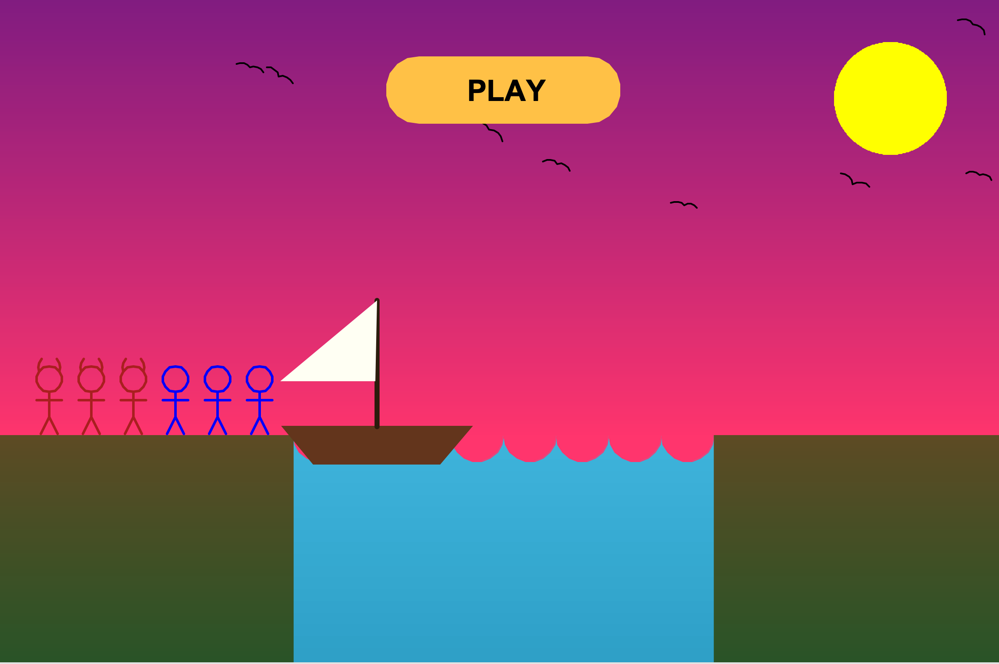
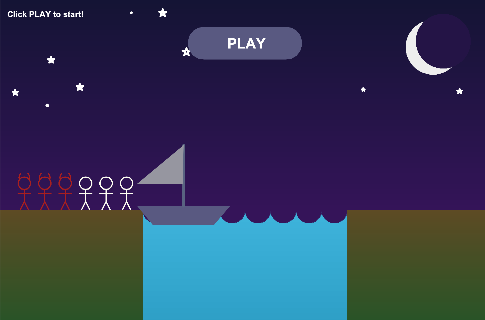
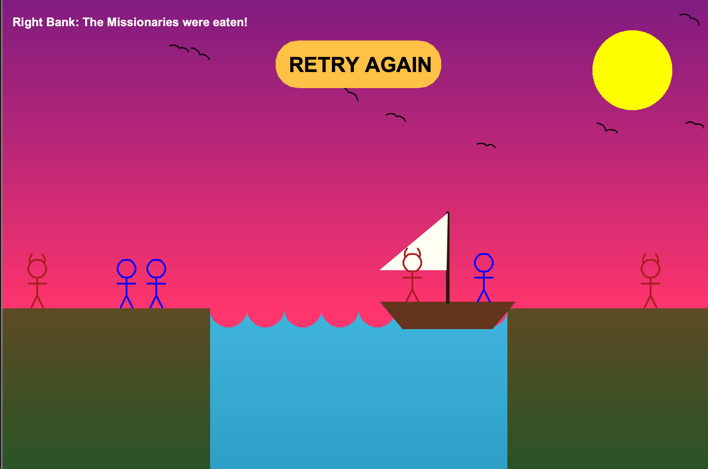
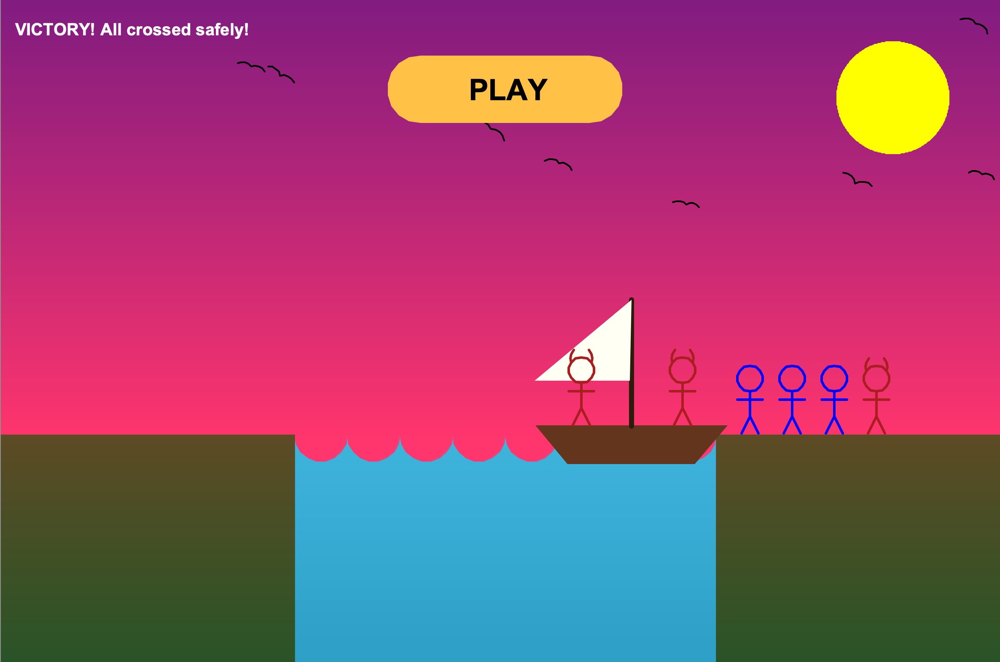

<div align="center">
  <h1>🛶 Missionaries and Cannibals Game 👹</h1>
  <p><i>A classic logic puzzle brought to life with Python Turtle Graphics!</i></p>
</div>

---

## 📖 About the Project

This project is a fully interactive, graphical implementation of the classic **Missionaries and Cannibals** river-crossing logic puzzle. Built entirely from scratch using Python's built-in `turtle` module, this game features custom-drawn graphics, smooth animations running at 60 FPS, and a dynamic Day/Night cycle.

The game challenges your logical thinking and problem-solving skills with an intuitive point-and-click interface.

## ✨ Features

- **Custom Turtle Graphics:** All assets, including the characters (Missionaries & Cannibals), the boat, waves, birds, and the sun/moon, are dynamically rendered using Turtle drawing commands.
- **Day / Night Cycle:** Click the Sun/Moon to toggle between a vibrant daytime and a calm, starry night. The environment colors and sky gradients smoothly transition to match the time of day!
- **Smooth 60FPS Rendering:** The game utilizes a custom render loop (`screen.ontimer`) to ensure smooth animations and instant UI feedback.
- **Algorithmic Drawing:** Employs the **Mid-Point Circle Drawing Algorithm** to efficiently render perfect wave curves and celestial bodies.
- **Procedural Gradients:** Beautiful, procedurally generated gradient backgrounds for the sky and the river.
- **Full Game Logic & State Management:** Handles win conditions, game over states, and movement logic to prevent invalid moves.

## 🧠 The Rules

Three missionaries and three cannibals must cross a river using a boat which can carry at most two people, under the following constraints:
1. **The Boat Needs a Driver:** The boat cannot cross the river by itself with no people on board. It requires at least 1 person to operate.
2. **Never Be Outnumbered:** If there are missionaries present on a bank, they cannot be outnumbered by cannibals. If cannibals ever outnumber missionaries on either bank, the cannibals will eat the missionaries, and it's **Game Over!**

Your goal is to safely transport all 6 characters from the left bank to the right bank.

## 🎮 How to Play

1. **Start the Game:** Click the big **PLAY** button on the start screen.
2. **Board the Boat:** Click on a Missionary (Blue) or a Cannibal (Red) to move them onto the boat. The boat can hold up to 2 characters.
3. **Unload the Boat:** Click on a character inside the boat to move them back to the bank.
4. **Move the Boat:** Once you have 1 or 2 passengers on board, click on the **Boat** to travel across the river.
5. **Toggle Day/Night:** Click on the **Sun** (or Moon) in the top-right corner to switch between Day and Night themes at any time.

## 📸 Screenshots

*(Replace the placeholder links with the actual paths to the shared images)*

| Day Mode Gameplay | Night Mode Gameplay |
|:---:|:---:|
|  |  |

| Game Over | Victory |
|:---:|:---:|
|  |  |

## ⚙️ Installation and Setup

This game requires no external libraries other than a standard Python 3 installation, as it relies entirely on the built-in `turtle` module.

1. **Clone or Download the Repository:**
   Ensure you have the project files, primarily `main.py`.
2. **Run the Game:**
   Open a terminal or command prompt, navigate to the project directory, and execute the following command:
   ```bash
   python main.py
   ```
   *(Note: On macOS/Linux, you might need to use `python3 main.py`)*

## 🛠️ Technical Details

- **Language:** Python 3
- **Graphics Library:** `turtle` (Tkinter wrapper)
- **Computer Graphics Concepts Used:**
  - **Mid-Point Circle Algorithm:** Used for accurate and performant rendering of the waves (`draw_midpoint_wave_segment`) and the Sun/Moon (`draw_pixel_circle`).
  - **Color Interpolation:** Calculates gradient steps for rendering the sky and water realistically based on the height resolution.
  - **State Machine:** A centralized `state` dictionary keeps track of character positions, boat side, passengers, and game status (won, over, started).

## 🤝 Contributing
Feel free to fork this project, submit pull requests, or open issues to suggest new features (like sound effects, fewer/more characters, or high scores) or report bugs. Enjoy the puzzle!
